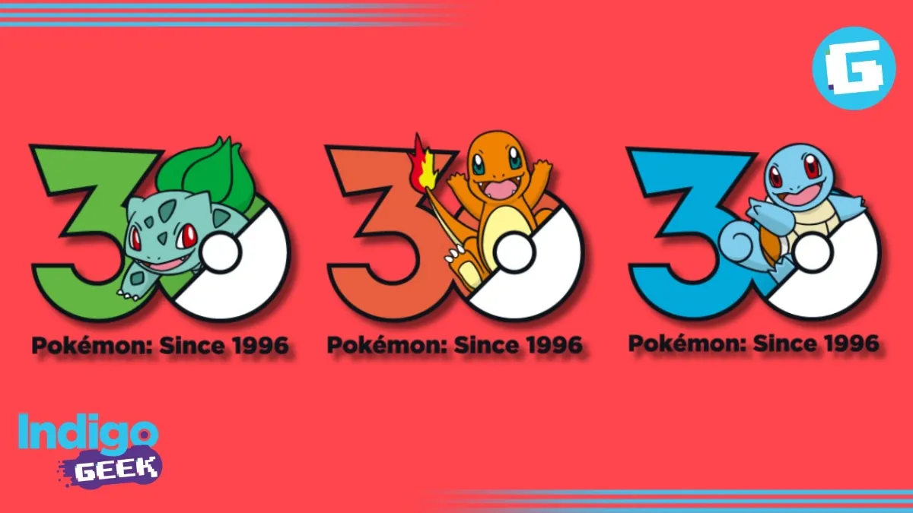
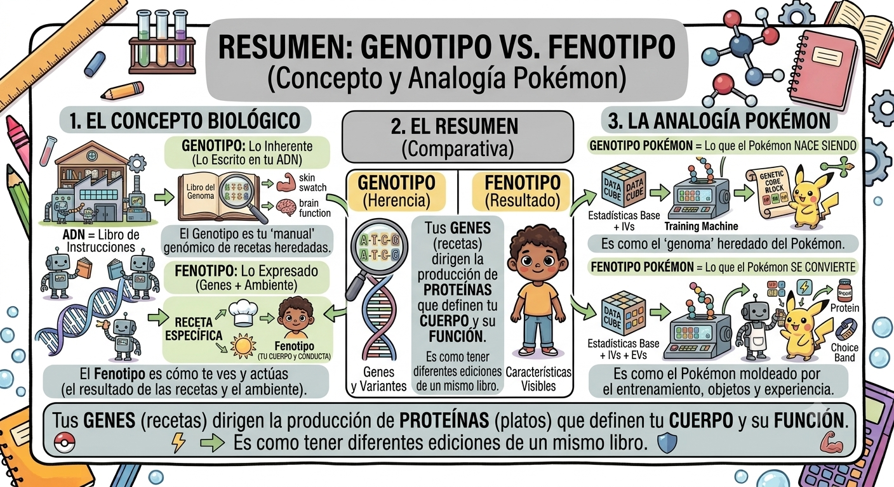

# **Actividad:** Lo que los datos nos cuentan

> Instructor: Zuriel Ceja

Interpretar visualizaciones y reconocer patrones en los datos, diferenciando métricas técnicas de significado biológico.

{fig-align="center"}

Notas personales de Zuriel. Espero que les funcione 💜

::: callout-note
[Presentación completa](https://docs.google.com/presentation/d/1ZaGkUdDG8wUcgQXKfjXXOcbIGAAXR8fbzygzTGBwrts/edit?usp=sharing) en Google slides.
:::

## **Explorando el Mundo Pokémon: Análisis de Datos y Descubrimientos 🎮📊**

**Pokémon celebra su 30 aniversario en 2026**, marcando tres décadas desde su lanzamiento original en **1996**. Como parte de las celebraciones, Pokémon Company reveló **1,025 logos oficiales** para conmemorar este hito importante.

[{fig-align="center"}](https://geek.reporteindigo.com/noticia/pokemon-revela-1025-logos-oficiales-para-celebrar-el-30-aniversario-con-dinamica-20260223-0008.html)

### **Datos Curiosos sobre Pokémon 🔍**

- **Primer lanzamiento**: Los juegos Pokémon Rojo y Verde se lanzaron el **27 de febrero de 1996** en Japón.
- **Generación original**: La primera generación tenía **151 Pokémon** (incluyendo Mew)
- **Expansión actual**: Existen más de **1,000 Pokémon** diferentes en las generaciones más recientes
- **Tipos de Pokémon**: Hay **18 tipos diferentes** (Normal, Fuego, Agua, Planta, etc.)
- **Estadísticas base**: Cada Pokémon tiene 6 estadísticas: **HP, Ataque, Defensa, Ataque Especial, Defensa Especial y Velocidad**
- **Distribución de tipos**: El tipo Normal es el más común, mientras que algunos tipos como Hada son más raros

## **Pokémon como Modelo para Entender Genes, Ambiente y Clasificación 🧬**

### **La Analogía Fundamental**

Así como los **Pokémon tienen características específicas que los definen**, los **organismos vivos (incluyendo humanos) tienen genes que determinan sus rasgos**. Veamos cómo funciona:

### **1. GENES = Estadísticas Base de Pokémon 📊**

**Concepto biológico**: Los genes son instrucciones heredadas que determinan características físicas y funcionales.

**Analogía Pokémon**: Las **estadísticas base** (HP, Ataque, Defensa, Ataque Especial, Defensa Especial, Velocidad) son como los "genes" de un Pokémon.

| Aspecto | Gen Biológico | Estadística Pokémon |
|------------------------|------------------------|------------------------|
| **Herencia** | Se heredan de los padres | Se heredan de la especie Pokémon |
| **Determinan** | Características físicas y funcionales | Capacidades y fortalezas en batalla |
| **Variabilidad** | Pequeñas diferencias entre individuos | Pequeñas variaciones (IVs - Individual Values) |
| **Expresión** | Se manifiestan en el fenotipo | Se expresan en el desempeño real |

**Ejemplo práctico**:

- Un humano hereda genes para ser alto → Un Charizard hereda estadísticas altas de Ataque
- Un humano hereda genes para ser rápido → Un Alakazam hereda estadísticas altas de Velocidad

{fig-align="center"}

### **2. AMBIENTE = Entrenamiento y Experiencia 🌍**

**Concepto biológico**: El ambiente influye en cómo se expresan los genes. Un gen para altura no se desarrolla completamente sin nutrición adecuada.

**Analogía Pokémon**: El **entrenamiento, los objetos, las vitaminas y la experiencia** son como el "ambiente" que moldea al Pokémon.

| Aspecto | Ambiente Biológico | Ambiente Pokémon |
|------------------------|------------------------|------------------------|
| **Influencia** | Nutrición, clima, estrés | Entrenamiento, objetos, experiencia |
| **Efecto** | Modifica la expresión génica | Aumenta estadísticas (EVs - Effort Values) |
| **Resultado** | Fenotipo final | Pokémon completamente desarrollado |
| **Reversibilidad** | Parcialmente reversible | Parcialmente reversible (reset de EVs) |

**Ejemplo práctico**:

- Un humano con genes para ser fuerte + buena nutrición = Adulto muy fuerte
- Un Pokémon con estadísticas altas de Ataque + entrenamiento en Ataque = Pokémon poderoso en batalla

{fig-align="center"}

### **3. GENOTIPO vs FENOTIPO 🔍**

**Concepto biológico**:

- **Genotipo**: Los genes que heredas (lo que está escrito en tu ADN)
- **Fenotipo**: Cómo te ves y actúas (resultado de genes + ambiente)

**Analogía Pokémon**:

- **Genotipo**: Las estadísticas base + IVs (lo que el Pokémon "nace siendo")
- **Fenotipo**: Las estadísticas finales después del entrenamiento (lo que el Pokémon "se convierte")

```         
Genotipo Pokémon = Estadísticas Base + IVs (herencia)
Fenotipo Pokémon = Estadísticas Base + IVs + EVs (herencia + ambiente)
```

**Ejemplo visual**:

- Dos Pikachu nacen con el mismo genotipo (mismas estadísticas base)
- Uno es entrenado intensamente en Ataque (ambiente favorable)
- El otro no recibe entrenamiento (ambiente desfavorable)
- Resultado: Fenotipos diferentes, aunque genotipos iguales

{fig-align="center"}

### **4. CLASIFICACIÓN TAXONÓMICA = Tipos Pokémon 🏷️**

**Concepto biológico**: Los organismos se clasifican en categorías (Reino, Filo, Clase, Orden, Familia, Género, Especie) basadas en características compartidas.

**Analogía Pokémon**: Los **tipos Pokémon** (Normal, Fuego, Agua, Planta, etc.) son como las **categorías taxonómicas**.

| Aspecto | Clasificación Biológica | Tipos Pokémon |
|------------------------|------------------------|------------------------|
| **Propósito** | Organizar por características compartidas | Organizar por características compartidas |
| **Niveles** | 7 niveles (Reino → Especie) | 18 tipos principales |
| **Criterio** | Evolución, anatomía, genética | Elemento, energía, naturaleza |
| **Relaciones** | Árbol evolutivo | Ventajas/desventajas de tipo |

**Ejemplo práctico**:

- Humanos clasificados como: Animalia → Chordata → Mammalia → Primates → Hominidae → Homo → sapiens
- Charizard clasificado como: Tipo Fuego/Volador (comparte características con otros Pokémon de fuego)

{fig-align="center"}

### **5. EVOLUCIÓN Y HERENCIA 🔄**

**Concepto biológico**: Los organismos evolucionan y heredan características de ancestros comunes.

**Analogía Pokémon**: Las **cadenas evolutivas** (Charmander → Charmeleon → Charizard) muestran cómo los Pokémon "evolucionan" y heredan características de sus formas anteriores.

| Aspecto | Evolución Biológica | Evolución Pokémon |
|------------------------|------------------------|------------------------|
| **Proceso** | Cambios graduales a lo largo de generaciones | Transformación de una forma a otra |
| **Herencia** | Rasgos ancestrales persisten | Estadísticas base aumentan, tipo se mantiene |
| **Adaptación** | Respuesta al ambiente | Respuesta a condiciones específicas (nivel, piedra, amistad) |

{fig-align="center"}
