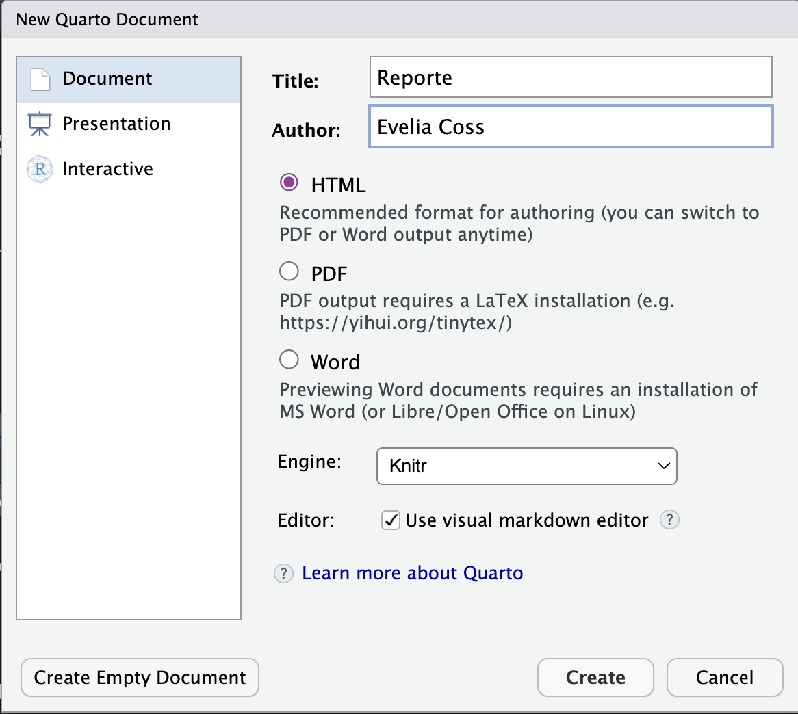
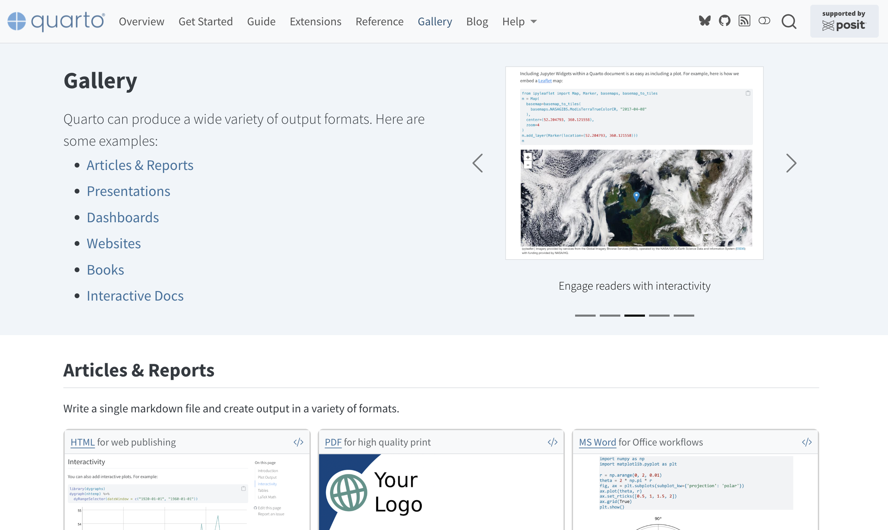
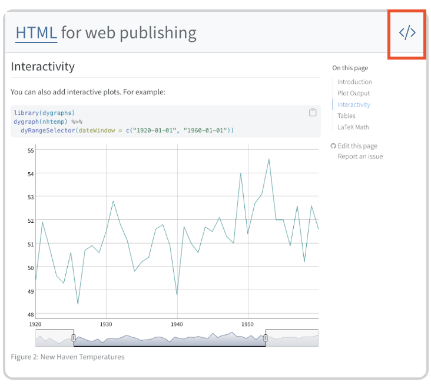
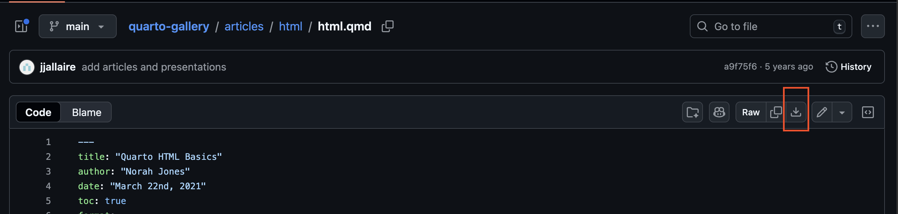

# **📚** Actividad: Explora datos genéticos reales

Ejercicio práctico para familiarizarse con datasets auténticos y reconocer su estructura.

## **📚** Actividad 1: Crear un documento de Quarto con formato de salida html

Para crear un documento nuevo, ve a **Archivos/File** \> **Nuevo archivo** \> **Documento de Quarto.**

{fig-align="center"}

Para este tipo de archivos vamos a usar la información del [YAML para HTML](https://quarto.org/docs/reference/formats/html.html).

## **📚** Actividad 2: Explorar la galleria de Quarto y elegir un diseño

1.  Visita la [galeria de Quarto](https://quarto.org/docs/gallery/).
2.  Ve al apartado de [Articles & Reports](https://quarto.org/docs/gallery/#articles-reports)**.**

{fig-align="center"}

3.  Selecciona un diseño y da clic en el botón "\</\>".

{fig-align="center"}

4.  Descarga el archivo desde GitHub y abrelo en Rstudio.

{fig-align="center"}

::: {.callout-note icon="false"}
## Actividad

Descarga este [ejemplo sobre el paquete palmerpenguins](https://github.com/EveliaCoss/CdeCMx2026_Club_LPZ3_libro/palmerpenguins_quarto.qmd) y comienza a editarlo.\
Aquí puedes ver su [visualización](https://github.com/EveliaCoss/CdeCMx2026_Club_LPZ3_libro/palmerpenguins_quarto.html).
:::

## Referencias

- [Tutorial: Hello, Quarto](https://quarto.org/docs/get-started/hello/rstudio.html)
