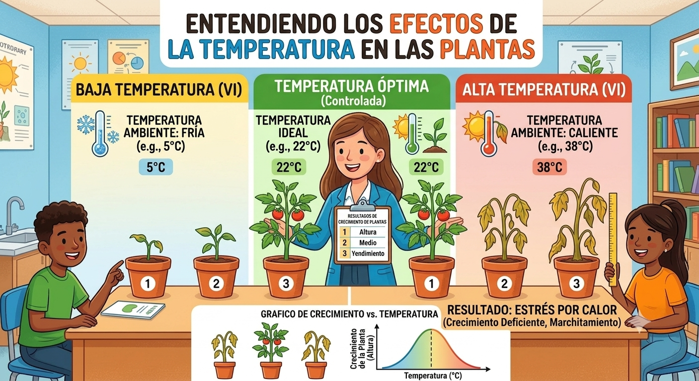
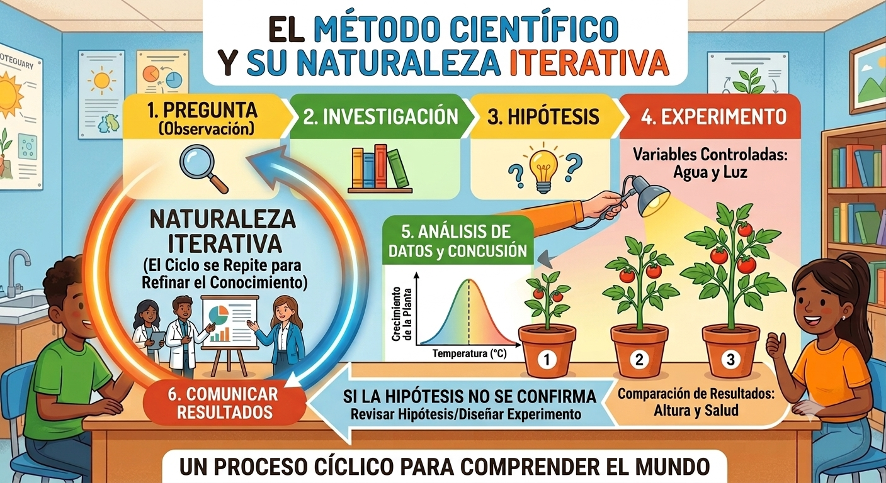
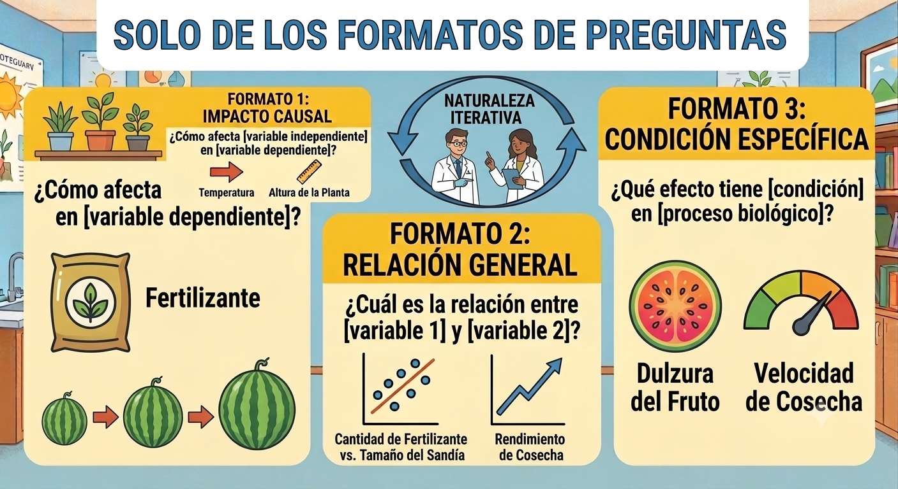

# Cómo formular preguntas biológicas

> Instructora: Evelia Coss

Diseñar preguntas claras que conecten hipótesis con datos disponibles.

## **VARIABLE INDEPENDIENTE**

Es la variable que **TÚ CAMBIAS o MANIPULAS** deliberadamente en tu experimento. Es la **causa** que estás investigando.

**Características**:

- La controlas tú (el investigador)
- Es lo que modificas para ver qué pasa
- Aparece en el eje X (horizontal) de un gráfico

::: {.callout-tip icon="false"}
**Ejemplo práctico**:
Si investigas cómo la **temperatura** afecta el crecimiento de plantas, la temperatura es tu variable independiente porque TÚ la cambias (10°C, 20°C, 30°C, etc.).

**Otro ejemplo:** Evaluación de un tratamiento con rangos diferentes de concentración de un medicamento o un diferentes tipos
:::

## **VARIABLE DEPENDIENTE**

Es la variable que **MIDES u OBSERVAS** como resultado. Es el **efecto** que esperas ver.

**Características**:

- Depende de lo que hagas con la variable independiente
- Es lo que cambias como consecuencia
- Aparece en el eje Y (vertical) de un gráfico
- Es lo que realmente te interesa medir

::: {.callout-tip icon="false"}
**Ejemplo práctico**: En el mismo experimento, el **crecimiento de las plantas** (altura en cm, número de hojas, biomasa) es tu variable dependiente porque esperas que cambie según la temperatura que apliques.
:::

##  **RELACIÓN CAUSA-EFECTO**

Piénsalo así:

```         
Variable independiente -> Variable dependiente
```

**"Si cambio la temperatura, ¿qué pasará con el crecimiento?"**

```         
Temperatura -> Crecimiento de plantas
```

{fig-align="center"}

## Ejemplos preguntas y variables

| **Pregunta Biológica** | **Variable Independiente** | **Variable Dependiente** |
|----|----|----|
| ¿Cómo afecta la luz en la fotosíntesis? | Intensidad de luz (baja, media, alta) | Tasa de fotosíntesis ( producido) |
| ¿Influye el pH en la actividad enzimática? | pH del medio (ácido, neutro, básico) | Velocidad de reacción enzimática |
| ¿Cómo cambia la frecuencia cardíaca con el ejercicio? | Intensidad del ejercicio (reposo, moderado, intenso) | Frecuencia cardíaca (latidos/minuto) |
| ¿Afecta la salinidad al crecimiento de bacterias? | Concentración de sal en el medio | Número de colonias bacterianas |

## Ejemplos y variables identificadas

Presenta estas situaciones y pide que identifiquen cuál es la variable independiente y cuál la dependiente:

1.  Un estudiante quiere saber si el tipo de suelo afecta la germinación de semillas. VI: tipo de suelo \| VD: germinación (sí/no, porcentaje)
2.  Una investigadora estudia cómo la dosis de un medicamento influye en la presión arterial. VI: dosis del medicamento \| VD: presión arterial
3.  Un biólogo examina si la cantidad de agua afecta el tamaño de las flores. VI: cantidad de agua \| VD: tamaño de flores

::: callout-note
## Resumen

- **Independiente** = Lo que TÚ controlas (la causa)

- **Dependiente** = Lo que MIDES (el efecto)

- La dependiente "depende" de lo que hagas con la independiente 🔗
:::

## **Método Científico en 5 Pasos**

- Vamos a partir de:

  - Pregunta → Hipótesis → Predicción → Experimento → Análisis
  - Diagrama visual del ciclo
  - Énfasis en que es un proceso iterativo

::: {.callout-note icon="false"}
## Ejemplo

- **Pregunta:** ¿Cómo afecta la temperatura al crecimiento de una planta?
- **Hipótesis:** Si aumentamos la temperatura a un nivel óptimo, la planta crecerá más rápido.
- **Predicción:** A 22°C la planta crecerá más alta que a 5°C o a 38°C.
- **Experimento:** Colocar plantas idénticas a 5°C (frío), 22°C (óptimo) y 38°C (calor) manteniendo iguales el agua y la luz.
- **Análisis:** Medir la altura de las plantas para confirmar o refutar la hipótesis.
:::

{fig-align="center"}

## 🔬 ¿Cómo Armar una Pregunta Biológica?

### PASO 1: Observa la Naturaleza 👀

Comienza con algo que te intriga o que ves en el mundo real.

**Ejemplos de observaciones:**

- "Noto que las plantas crecen más rápido cerca de la ventana"
- "Observo que algunos insectos son más activos de noche"
- "Veo que las hojas cambian de color en otoño"

### PASO 2: Convierte la Observación en Curiosidad ❓

Pregúntate el "¿por qué?" o "¿cómo?" de lo que observaste.

**Ejemplos de curiosidad inicial:**

- "¿Por qué las plantas crecen más cerca de la ventana?"
- "¿Por qué algunos insectos son más activos de noche?"
- "¿Por qué las hojas cambian de color?"

### PASO 3: Refina la Pregunta - Hazla Específica 🎯

Aquí es donde transformas la curiosidad general en una **pregunta biológica real**. Debes:

✅ **Ser específico**: No preguntes sobre "plantas" en general, sino sobre una característica medible
✅ **Ser observable**: Debe ser algo que puedas ver, medir o cuantificar
✅ **Ser testeable**: Debe poder responderse mediante experimentación

**Ejemplo de refinamiento:**

| ❌ Pregunta vaga | ✅ Pregunta biológica |
|------------------------------|------------------------------------------|
| "¿Por qué las plantas crecen más cerca de la ventana?" | "¿Cómo afecta la intensidad de luz en el crecimiento de altura de plantas de tomate?" |
| "¿Por qué algunos insectos son más activos de noche?" | "¿Cuál es la relación entre la intensidad de luz y la actividad locomotora de cucarachas?" |
| "¿Por qué las hojas cambian de color?" | "¿Qué factores ambientales (temperatura, luz) desencadenan la degradación de clorofila en hojas de árboles deciduos?" |

### PASO 4: Verifica que Cumpla los Criterios ✅

Tu pregunta biológica debe cumplir con TODOS estos criterios:

#### 🔍 1. CLARA Y ESPECÍFICA

- Evita ambigüedades
- Usa términos precisos
- Identifica exactamente qué quieres investigar

**Ejemplo:**

- ❌ "¿Cómo afecta el agua a las plantas?" (demasiado vago)
- ✅ "¿Cómo afecta la frecuencia de riego en la biomasa total de plantas de frijol?" (específico)

#### 📊 2. OBSERVABLE Y MEDIBLE

- Debe referirse a algo que puedas ver, contar o medir
- Usa variables cuantificables

**Ejemplo:**

- ❌ "¿Por qué algunas bacterias son más fuertes?" (no es medible)
- ✅ "¿Cómo afecta la temperatura en la tasa de crecimiento de colonias bacterianas?" (medible: número de colonias, tiempo)

#### 🧪 3. TESTEABLE

- Debe poder responderse mediante experimentación
- No debe ser una pregunta filosófica o moral

**Ejemplo:**

- ❌ "¿Es importante que las plantas tengan luz?" (pregunta de valor, no científica)
- ✅ "¿Cuál es el efecto de la ausencia de luz en la producción de clorofila?" (testeable)

#### 📚 4. BASADA EN CONOCIMIENTO PREVIO

- Surge de observaciones reales o literatura científica
- No es completamente aleatoria

**Ejemplo:**

- ❌ "¿Los tomates pueden volar?" (sin base en la realidad)
- ✅ "¿Cómo afecta la salinidad del suelo en la absorción de agua por raíces de tomate?" (basada en conocimiento de osmosis)

#### 🎓 5. RELEVANTE CIENTÍFICAMENTE

- Contribuye al conocimiento biológico
- Tiene aplicaciones prácticas o teóricas

**Ejemplo:**

- ❌ "¿Cuántas veces puedo lanzar una moneda antes de que caiga cara?" (no es biología)
- ✅ "¿Cómo afecta la contaminación del aire en la tasa de fotosíntesis de plantas urbanas?" (relevante para ecología)

## 🎯 Estructura Recomendada para Formular la Pregunta

Usa esta estructura para asegurar que tu pregunta sea científica:

### Formato 1: "¿Cómo afecta \[variable independiente\] en \[variable dependiente\]?"

**Ejemplos:**

- "¿Cómo afecta la **temperatura** en la **tasa de germinación de semillas**?"
- "¿Cómo afecta la **concentración de sal** en la **altura de plantas de frijol**?"
- "¿Cómo afecta la **intensidad de luz** en la **producción de oxígeno en algas**?"

### Formato 2: "¿Cuál es la relación entre \[variable 1\] y \[variable 2\]?"

**Ejemplos:**

- "¿Cuál es la relación entre la **pH del agua** y la **supervivencia de peces**?"
- "¿Cuál es la relación entre la **edad del organismo** y la **capacidad de regeneración**?"

### Formato 3: "¿Qué efecto tiene \[condición\] en \[proceso biológico\]?"

**Ejemplos:**

- "¿Qué efecto tiene la **privación de sueño** en la **memoria de corto plazo**?"
- "¿Qué efecto tiene la **radiación UV** en la **mutación de bacterias**?"

{fig-align="center"}
