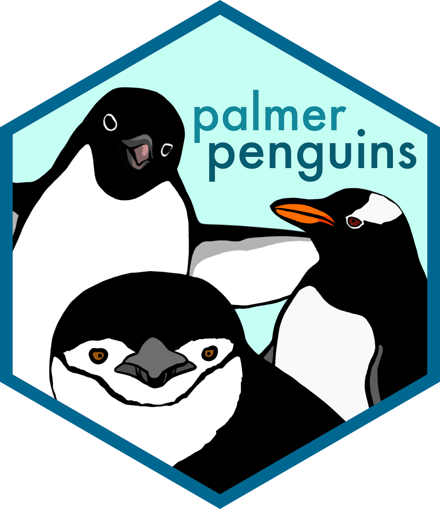
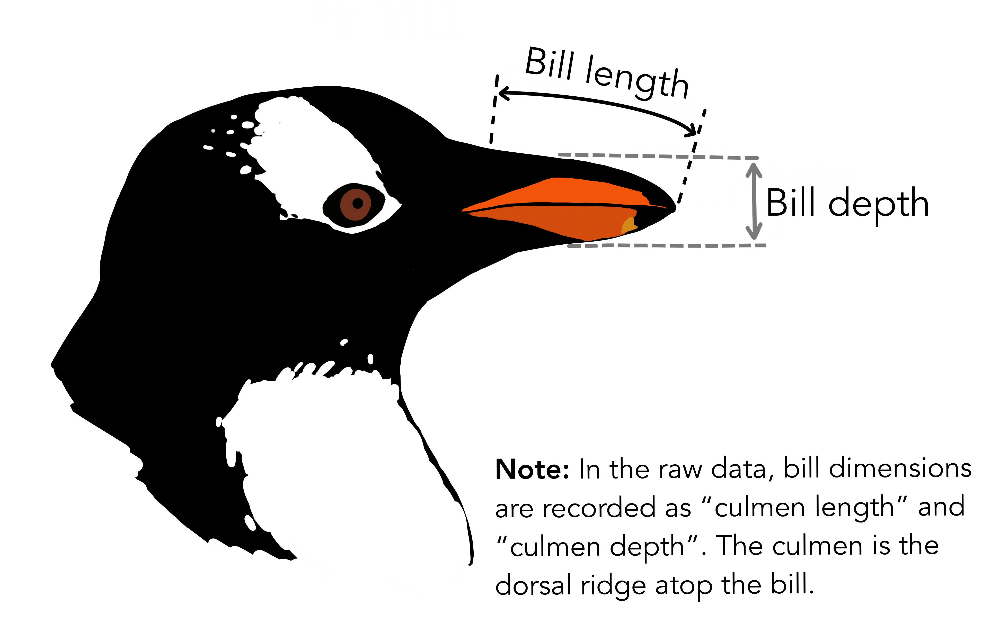

# Manipulación de datos en R

Carguemos los paquetes

```{r, message=FALSE, warning=FALSE}
library(palmerpenguins)
library(dplyr)
library(DT)
```

::: {.callout-important icon="false"}
## Nota 1

En **R** y en **Bash** existe el comando `head`, que permite visualizar los primeros elementos de un objeto o archivo.\
- En **R**: `head(mi_vector)` muestra los primeros valores de un vector o data frame.\
- En **Bash**: `head archivo.txt` muestra las primeras líneas de un archivo de texto.\
Esto es útil para inspeccionar rápidamente datos sin necesidad de abrir todo el contenido.
:::

::: {.callout-important icon="false"}
## Nota 2

En **R** (con `dplyr`) usamos el operador **pipe `%>%`** para encadenar funciones, cumple una función muy similar al **pipe \|** en **Bash**.

Ambos operadores permiten construir flujos de trabajo claros y reproducibles.

En RStudio, **pipe `%>%`** se inserta rápido con:

- Windows/Linux: Ctrl + Shift + M
- iOS / Mac: Cmd + Shift + M
:::

::: {.callout-important icon="false"}
## Nota 3

En **R** podemos usar `::` para indicar que una función proviene de un paquete específico.\
- Ejemplo: `dplyr::select()` llama directamente a la función `select` del paquete **dplyr**.\
- Esto evita conflictos cuando diferentes paquetes tienen funciones con el mismo nombre.\
- Podemos **cargar un paquete completo** con `library(dplyr)` o **usar solo una función** con `dplyr::función`.

La manera correcta para evitar ambigüedades es usar siempre `paquete::función` cuando hay riesgo de conflicto.
:::

::: callout-tip
## Tip

En este curso trabajaremos principalmente con **dplyr** y el operador `%>%`, ya que ofrece una sintaxis clara y didáctica para manipular data frames y tibbles.

Sin embargo, es importante saber que para **datasets muy grandes** existe el paquete **data.table**, que está optimizado para velocidad y eficiencia en memoria.

- **dplyr**: más intuitivo y expresivo, ideal para aprendizaje y proyectos colaborativos. Puedes ver el [video donde explico más sobre el uso de dplyr](https://github.com/EveliaCoss/ViernesBioinfo2024#viernes-7-manipulaci%C3%B3n-de-datos-usando-dplyr).
- [**data.table**](https://sofiazorrilla.github.io/data.table_long/): más rápido y eficiente, recomendado en contextos de *big data*. Puedes ver el video de [VieRnes de Bioinformática con nuestras instructoras](https://github.com/EveliaCoss/ViernesBioinfo2024_parte2#viernes-2-y-3-introducci%C3%B3n-al-paquete-datatable-en-r).
:::

## Paquete `palmerpenguins`

::::: columns
::: {.column width="60%"}
El objetivo de palmerpenguins es proporcionar un gran conjunto de datos para la exploración y visualización de datos, como alternativa a `iris`.

- Paquete en CRAN: [palmerpenguins](https://allisonhorst.github.io/palmerpenguins/articles/intro.html)
- GitHub: [palmerpenguins](https://github.com/allisonhorst/palmerpenguins/)
- Zenodo del paquete: [allisonhorst/palmerpenguins: v0.1.0](https://zenodo.org/records/3960218)
- Zenodo de los datos: [datos de palmerpenguins](https://zenodo.org/records/14902740)
- Artículo: <https://doi.org/10.1371/journal.pone.0090081>
:::

::: {.column width="40%"}
{fig-align="right" width="178"}
:::
:::::

## Acerca de los datos

Los datos fueron recopilados y puestos a disposición por [la Dra. Kristen Gorman](https://www.uaf.edu/cfos/people/faculty/detail/kristen-gorman.php) y la [Estación Palmer, Antártida LTER](https://pallter.marine.rutgers.edu/) , miembro de la [Red de Investigación Ecológica a Largo Plazo](https://lternet.edu/).

## Medidas de tamaño de pingüinos adultos en busca de alimento cerca de la Estación Palmer, Antártida

Una de ellas se llama `penguins`, y es una versión simplificada de los datos brutos; consulte [`?penguins`](https://allisonhorst.github.io/palmerpenguins/reference/penguins.html)para obtener más información:

```{r}
head(penguins) %>% 
  DT::datatable(rownames = FALSE)
```

:::::: {.callout-tip icon="false" collapse="true"}
## ¿Qué nos dicen las columnas de `penguins`?

::::: columns
::: {.column width="60%"}
- **species / especies**: un factor que indica la especie de pingüino (Adelia, Barbijo y Gentoo)
- **island / isla**: un factor que denota una isla en el archipiélago Palmer, Antártida (Biscoe, Dream o Torgersen)
- **bill_length_mm / longitud del pico en mm**: un número que indica la longitud del pico (en milímetros)
- **bill_depth_mm / grosor del pico en mm**: un número que indica la grosor del pico (milímetros)
- **flipper_length_mm / longitud de la aleta en mm**: un número entero que indica la longitud de la aleta (en milímetros)
- **body_mass_g / masa corporal en gramos**: un número entero que indica la masa corporal (gramos)
- **sex / sexo**: un factor que indica el sexo del pingüino (hembra, macho)
- **year / año del estudio**: un número entero que indica el año del estudio (2007, 2008 o 2009)

Información tomada de la página principal de [palmerpenguins](https://allisonhorst.github.io/palmerpenguins/reference/penguins.html).
:::

::: {.column width="40%"}
{fig-align="right" width="380"}
:::
:::::
::::::

## Tamaño, puesta y datos de isótopos sanguíneos de pingüinos adultos en busca de alimento cerca de la Estación Palmer, Antártida

El segundo conjunto de datos es `penguins_raw`, y contiene todas las variables y los nombres originales tal como se descargaron; consulte [`?penguins_raw`](https://allisonhorst.github.io/palmerpenguins/reference/penguins_raw.html)para obtener más información.

```{r}
head(penguins_raw, 4) %>% 
  DT::datatable(rownames = FALSE)
```

::: {.callout-tip icon="false" collapse="true"}
## ¿Qué nos dicen las columnas de `penguins_raw`?

- **studyName /nombre del estudio** : Expedición de muestreo a partir de la cual se recopilaron, generaron, etc., datos.
- **Sample Number / Número de muestra** un número entero que denota la secuencia de numeración continua para cada muestra.
- **Species/ Especies**: una cadena de caracteres que denota la especie de pingüino.
- **Region/ Región**: una cadena de caracteres que indica la región de la cuadrícula de muestreo de Palmer LTER.
- **Island / Isla**: una cadena de caracteres que indica la isla cercana a la estación Palmer donde se recolectaron las muestras
- **Stage / Escenario**: una cadena de caracteres que indica la etapa reproductiva en el momento de la toma de muestras
- **Individual ID / Identificación individual**: una cadena de caracteres que indica el ID único de cada individuo en el conjunto de datos.
- **Clutch Completion / Finalización del embrague**: una cadena de caracteres que indica si el nido estudiado se observó con una nidada completa, es decir, 2 huevos.
- **Date Egg / Fecha de muestreo del huevo**: una fecha que indica la fecha en que se observó el nido estudiado con 1 huevo (muestreado).
- **Culmen Length / Longitud de la cresta dorsal**: un número que indica la longitud de la cresta dorsal del pico de un ave (en milímetros)
- **Culmen Depth / Profundidad del culmen**: un número que indica la profundidad de la cresta dorsal del pico de un ave (en milímetros)
- **Flipper Length/ Longitud de la aleta**: un número entero que indica la longitud de la aleta del pingüino (en milímetros)
- **Body Mass/ Masa corporal**: un número entero que indica la masa corporal del pingüino (en gramos)
- **Sex / Sexo**: una cadena de caracteres que indica el sexo de un animal
- **Delta 15 N**: un número que indica la medida de la proporción de isótopos estables 15N:14N
- **Delta 13 C**: un número que indica la medida de la proporción de isótopos estables 13C:12C
- **Comments/ Comentarios**: una cadena de caracteres con texto que proporciona información adicional relevante para los datos.
:::

## Revisar las dimensiones de un objeto

| **Función** | **Descripción** | **Ejemplo** |
|------------------|-------------------------------|-----------------------|
| `length()` | Devuelve el número de elementos de un vector o lista. | `length(1:10)` → 10 |
| `dim()` | Devuelve las dimensiones (filas, columnas) de matrices y data frames. | `dim(penguins)` → 344 8 |
| `nrow()` | Número de filas de un objeto tipo data frame o matriz. | `nrow(penguins)` → 344 |
| `ncol()` | Número de columnas de un objeto tipo data frame o matriz. | `ncol(penguins)` → 8 |
| `str()` | Muestra la estructura del objeto, incluyendo dimensiones y tipo de datos. | `str(penguins)` |

Ambos conjuntos de datos contienen información sobre **344 pingüinos**. Estos conjuntos de datos incluyen **3 especies diferentes de pingüinos, recopiladas en 3 islas** del archipiélago Palmer, en la Antártida. Vamos a revisar la estructura de los datos:

```{r}
str(penguins)
```

::: callout-tip
## ¿Qué significa?

- `tibble` → Es una versión moderna del *data frame*, creada por el paquete **tibble/dplyr**.

- `[344 × 8]` → Son las dimensiones del objeto:

  - **344 filas** → cada fila representa una observación o registro.

  - **8 columnas** → cada columna representa una variable o atributo.
:::

## Funciones que vamos a emplear de `dplyr`

::: {.callout-note appearance="minimal" icon="false"}
- `select()` : Seleccionar nombres de las columnas. --\> select(dataframe, columna1, columna2, ... columnax)
- `filter()` : Filtrar filas por una condicion especifica, apartir de la columna. --\> filter(dataframe, columna1 == "condicion")
- `mutate()` : Modificar o agregar columnas. --\> mutate(dataframe, columna1 = "condicion")
- `group_by()` : Agrupar informacion de acuerdo a un(as) columna(s) seleccionada(s).
- `if_else()` : Condicional. --\> if_else(dataframe, codicion, si se acepta entonces, si se rechaza entonces)
- `arrange()` : Acomodar los resultados, default de menor a mayor.
- `count()`: Cuenta los valores de acuerdo a una variable.
- `left_join()` : Unir dos dataframe con base en una misma columna en comun. --\> left_join(dataframe1, dataframe2, by = "Columna en comun, mismo nombre")
- `n_distinct()` : Cuenta las filas unicas.
- `distinct()` : Muestra las filas duplicadas.
- `summarise()` : reduce varios valores seleccionados en un resumen.
:::

## Manos a la obra

::: {.callout-note icon="false" collapse="true"}
## Actividad: Número de especies

En el dataset `penguins` del paquete **palmerpenguins** se registran **3 especies de pingüinos**:

- Adelie
- Chinstrap
- Gentoo

1.  Podemos usar R base para identificar esta información:

```{r}
unique(penguins$species)
```

Emplear las funciones del paquete dplyr:

2.  Usar `distinct()` para obtener los valores únicos de la columna `species`.

```{r}
penguins %>% 
  dplyr::select(species) %>% 
  distinct() # Nos da valores unicos, sin duplicaciones
```

3.  Usar `n_distinct()` para obtener el número de especies unicas.

```{r}
penguins %>% 
  dplyr::select(species) %>% 
  n_distinct()
```

4.  ¿Cuántos datos registrados tenemos por especies o número de individuos por especie?

```{r}
penguins %>% 
  count(species) 
```
:::

::: {.callout-note icon="false" collapse="true"}
### Actividad: Sexo y Distribución del muestreo a través de las islas

1.  Número de individuos de cada sexo

```{r}
penguins %>% 
  count(sex) 
```

2.  ¿Cuántos hembras y machos hay de cada especie?

```{r}
penguins %>% 
  count(species, sex)
```

3.  Número de individuos registrados en cada isla:

```{r}
penguins %>% 
  count(island)
```

4.  Número de individuos registrados en cada isla:

```{r}
penguins %>% 
  count(species, island, sex)
```
:::

::: {.callout-note icon="false" collapse="true"}
### Actividad: Masa de los individuos

Crea una nueva columna llamada `body_mass_kg` que convierta el peso de gramos a kilogramos.

```{r}
penguins_kg <- penguins %>% 
  mutate(body_mass_kg = body_mass_g / 1000) 

head(penguins_kg)
```

Calcula el promedio de masa corporal por especie.

```{r}
penguins_kg %>% 
  group_by(species) %>% 
  summarise(mean_mass_kg = mean(body_mass_kg, na.rm = TRUE))
```

Crea una columna `peso_categoria` que indique `"Ligero"` si el pingüino pesa menos de 4000 g = 4kg y `"Pesado"` en caso contrario.

```{r}
penguins_kg <- penguins_kg %>% 
  mutate(peso_categoria = if_else(body_mass_kg < 4, "Ligero", "Pesado"))

head(penguins_kg)
```

¿Cuántos pingüinos tenemos por categoría?

```{r}
penguins_kg %>% 
  count(peso_categoria)
```

Clasifica a los pingüinos en categorías según su masa corporal:

- `< 3500 g` → `"Pequeño"`
- `3500–4500 g` → `"Mediano"`
- `> 4500 g` → `"Grande"`

```{r}
penguins_kg %>% 
  mutate(categoria = case_when(
    body_mass_g < 3500 ~ "Pequeño",
    body_mass_g >= 3500 & body_mass_g <= 4500 ~ "Mediano",
    body_mass_g > 4500 ~ "Grande"
  ))
```
:::

::: {.callout-note icon="false" collapse="true"}
### Actividad: Longitud del pico y del ala

Ordena los pingüinos por longitud del pico (`bill_length_mm`) de mayor a menor.

```{r}
penguins_kg %>% 
  arrange(desc(bill_length_mm)) %>%  # de mayor a menor
  # tambien se puede poner arrange(-bill_length_mm)
  head()
```

Si queremos que sea de menor a mayor, quitamos `desc()`.

```{r}
penguins_kg %>% 
  arrange(bill_length_mm) %>%  # de menor a mayor
  head()
```

Calcula el promedio y la desviación estándar de la longitud del ala (`flipper_length_mm`) por especie.

```{r}
penguins %>% 
  group_by(species) %>% 
  summarise(
    mean_flipper = mean(flipper_length_mm, na.rm = TRUE), #promedio
    sd_flipper = sd(flipper_length_mm, na.rm = TRUE) # desviacion estandar
  )
```
:::
