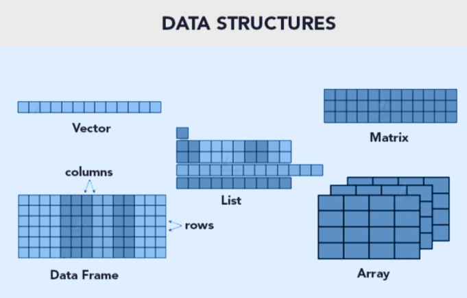

# Estructura de datos en R

## Principales estructuras de datos en R

Las estructuras de datos son objetos que contienen datos. Cuando trabajamos con R, lo que estamos haciendo es manipular estas estructuras.

{fig-align="center"}

| **Estructura** | **Dimensión** | **Homogeneidad** | **Ejemplo** | **Uso típico** |
|----|----|----|----|----|
| **Vector** | 1D | Homogénea (todos del mismo tipo) | `c(1,2,3)` | Secuencias simples de números, caracteres o lógicos |
| **Lista** | 1D | Heterogénea (puede mezclar tipos) | `list(a=1:3, b="hola")` | Agrupar objetos distintos, resultados de modelos |
| **Matriz** | 2D | Homogénea | `matrix(1:6, nrow=2)` | Cálculos numéricos, álgebra lineal |
| **Array** | nD (más de 2 dimensiones) | Homogénea | `array(1:8, dim=c(2,2,2))` | Datos multidimensionales, imágenes, series temporales |
| **Data frame** | 2D | Heterogénea (cada columna puede ser de distinto tipo) | `data.frame(x=1:3, y=c("a","b","c"))` | Datos tabulares, análisis estadístico |
| **Tibble** | 2D | Heterogénea | `tibble(x=1:3, y=c("a","b","c"))` | Variante moderna de data frame, impresión más clara |

## Clases de variables

| Clases | Declaración de la variable | Conversión de formato | Reglas |
|----|----|----|----|
| `numeric` | `numeric()` | `as.numeric()` | FALSE -\> 0, TRUE -\> 1; "1", "2", ... -\> 1,2, ...; "A" -\> NA |
| `integer` | `integer()` | `as.integer()` | FALSE -\> 0, TRUE -\> 1; "1", "2", ... -\> 1,2, ...; "A" -\> NA |
| `double` | `double()` | `as.double()` |  |
| `character` | `character()` | `as.character()` | 1,2, ... -\> "1", "2", ...; FALSE -\> "FALSE"; TRUE -\> "TRUE" |
| `logical` | `logical()` | `as.logical()` | 0 -\> FALSE, other numbers -\> TRUE; ("FALSE", "F") -\> FALSE; ("TRUE", "T") -\> TRUE, other character -\> NA |
| `factor` | `factor()` | `as.factor()` |  |

Si queremos saber la clase de la variable debemos usar `class()`, aunque tambien `str()` te dice esta información.

> NOTA: `as.integer()` convierte los numeros a enteros. Ejemplo: as.integer(2.5) = 2. En cambio, `as.double()` permite que los numeros contengan decimales.

## Operadores

| Aritméticos | Comparación | Argumentos lógicos (Logical Operators) |
|----|----|----|
| `+` Adición / suma | `<` Menor que | `!x` - Not x (logical NOT) |
| `-` Sustracción / resta | `>` Mayor que | `x & y` OR `x AND y` - (logical AND) |
| `*` Multiplicación | `<=` Menor o igual que | `x && y` - identico |
| `/` OR %% División | `>=` Mayor o igual que | `xor(x,y)` Funcion OR |
| `^` OR \*\* Exponencial | `==` Igual a | `%in%` pertenece a |
| `%/%` División integral | `!=` Diferente de |  |

Otra forma de escrir OR es `x | y` OR `x || y`.

## Jerarquía de operaciones

En R, al igual que en matemáticas, las operaciones tienen un orden de evaluación definido.

Cuanto tenemos varias operaciones ocurriendo al mismo tiempo, en realidad, algunas de ellas son realizadas antes que otras y el resultado de ellas dependerá de este orden.

| Orden | Operadores        |
|-------|-------------------|
| 1     | `^`               |
| 2     | `* /`             |
| 3     | `+ -`             |
| 4     | `< > <= >= == !=` |
| 5     | `!`               |
| 6     | `&`               |
| 7     | OR                |
