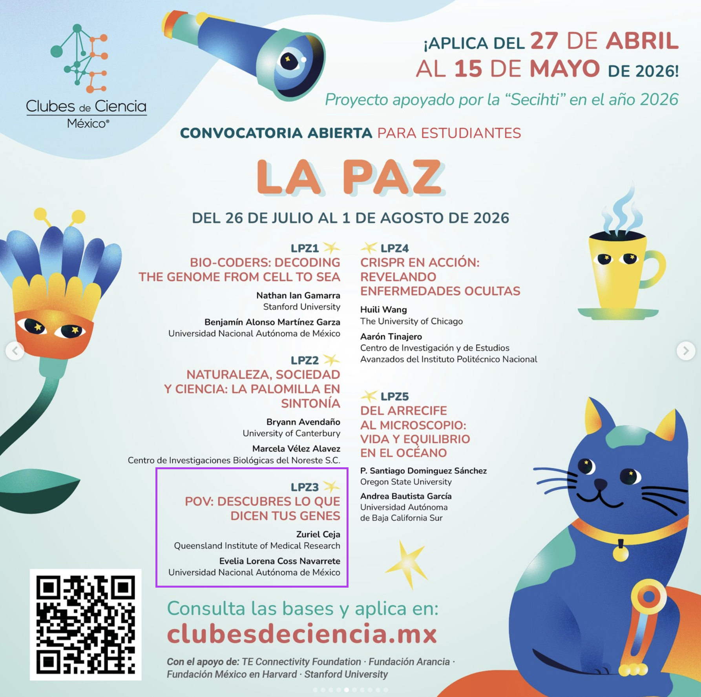

# Información general {.unnumbered}

- ::: {.panel-tabset group="globalInfo"}
  ### Sobre el curso 📌

  - **Idioma:** Impartido en español 
  - **Sede:** La Paz, Baja California Sur 
  - **Fechas:** 26 julio - 01 agosto, 2026 
  - **Horario:** Lunes - Viernes 9am a 5pm 
  - **Edición:** Clubes de Ciencia México, Verano 2026

  

  #### **Instructores:**

  - **Australia: Zuriel Ceja** - Estudiante de doctorado, QIMR Berghofer / The University of Queensland Zuriel.Ceja\@qimrb.edu.au GitHub: ZurielCeja 
  - **México: Dra. Evelia Lorena Coss-Navarrete** - Profesora de asignatura de la ENES Unidad Juriquilla. [Pagina web](https://eveliacoss.github.io/)

  #### **Resumen del club:**

  En este club explorarás cómo los genes interactúan con el entorno, el estrés, el sueño, los hábitos y la comunidad para influir en la salud y el bienestar. A través de actividades prácticas, analizarás datos reales en R (de manera accesible y guiada) para descubrir patrones en genética, cerebro y salud mental. También realizaremos una actividad de observación en ecosistemas de La Paz para relacionar variables ambientales con sistemas vivos. Al final, cada participante desarrollará un proyecto o dashboard para contar una historia con datos, desde su propio estilo y perspectiva.

  #### **Enfoque de la audiencia:**

  - **Público general interesado en aprender herramientas digitales**: no se requiere experiencia previa, el curso inicia desde cero.

  #### Patrocinador

  - Clubes de Ciencia México (CdeCMx) y Sede en la La Paz, Baja California Sur

  ## Citar y reutilizar el material del curso

  Los datos del curso se pueden reutilizar y adaptar libremente con la debida atribución. Todos los datos de los cursos de estos repositorios están sujetos a la licencia [Attribution-NonCommercial-ShareAlike 4.0 International (CC BY-NC-SA 4.0)](https://creativecommons.org/licenses/by-nc-sa/4.0/).

  ### Requisitos previos

  - Los participantes pueden traer su propia computadora (opcional). No se requiere experiencia previa: el curso comenzará desde cero.

  ### Agenda 📆 {#agenda}

  +----------------+---------------------------------------------------+-------------------------------------------------------------------------------------------------------------------+
  | Días           | Tema                                              | Actividades                                                                                                       |
  +================+===================================================+===================================================================================================================+
  | **Día 1**      | Introducción: Datos, Genes, y Tú                  | 1.  **Dinámica**: Bienvenida: Tú y tus genes                                                                      |
  |                |                                                   | 2.  **Clase**: Descubre qué son los genes                                                                         |
  | Lunes 27/julio |                                                   | 3.  **Clase**: Introducción a la bioinformática como lupa para la vida                                            |
  |                |                                                   | 4.  **Dinámica:** Primeros pasos en R con datos divertidos (Pokémon / conjuntos de datos divertidos)              |
  |                |                                                   | 5.  **Actividad**: Lo que los datos nos cuentan                                                                   |
  |                |                                                   | 6.  Introducción al proyecto final                                                                                |
  |                |                                                   | 7.  **Clase**: Cómo comunicar ciencia en un póster                                                                |
  +----------------+---------------------------------------------------+-------------------------------------------------------------------------------------------------------------------+
  | **Día 2**      | Descubre patrones en los datos                    | 1.  **Clase**: Explora y ordena tus datos                                                                         |
  |                |                                                   | 2.  **Clase**: Introducción a la visualización de datos                                                           |
  | Martes         |                                                   | 3.  **Dinámica**: Identificación de patrones en conjuntos de datos reales                                         |
  |                |                                                   | 4.  **Actividad**: Descubre algo interesante en un conjunto de datos                                              |
  | 28/julio       |                                                   | 5.  **Clase**: Primer vistazo a datos biológicos (ejemplos de genética y salud)                                   |
  |                |                                                   | 6.  **Clase**: Creación de tablas con información con estadística descriptiva                                     |
  |                |                                                   | 7.  **Actividad**: Casos de estudio salud pública                                                                 |
  +----------------+---------------------------------------------------+-------------------------------------------------------------------------------------------------------------------+
  | **Día 3**      | Caso de estudio: Genes y el sistema inmune        | 1.  **Clase**: Variantes genéticas y enfermedades del sistema inmune                                              |
  |                |                                                   | 2.  **Dinámica**: Exploración de bases de datos públicas                                                          |
  | Miércoles      |                                                   | 3.  **Actividad:** Explora datos genéticos reales                                                                 |
  |                |                                                   | 4.  **Dinámica**: Cómo formular preguntas biológicas                                                              |
  | 29/julio       |                                                   | 5.  **Actividad:** De la pregunta al análisis                                                                     |
  |                |                                                   | 6.  **Clase**: Creación de reportes con Quarto                                                                    |
  |                |                                                   | 7.  **Actividad en equipo**: Identificación de patrones en datos genéticos                                        |
  |                |                                                   | 8.  **Actividad en equipo**: bosquejo inicial del póster relacionado con el proyecto final                        |
  +----------------+---------------------------------------------------+-------------------------------------------------------------------------------------------------------------------+
  | **Día 4**      | Cerebro, Conducta y ambiente (Gene × Environment) | 1.  **Salida de campo**: Ecosistemas, genes y salud humana: ¿Qué nos puede enseñar la naturaleza sobre nosotros?  |
  |                |                                                   | 2.  **Actividad:** Mapeando sistemas                                                                              |
  | Jueves         |                                                   | 3.  **Actividad:** Traduciendo observaciones a humanos                                                            |
  |                |                                                   | 4.  **Actividad:** Gene x Environment Uno Game                                                                    |
  | 30/julio       |                                                   | 5.  **Actividad:** Construyendo una hipótesis Gene x Environment                                                  |
  |                |                                                   | 6.  **Actividad en equipo**: continuación del póster                                                              |
  +----------------+---------------------------------------------------+-------------------------------------------------------------------------------------------------------------------+
  | **Día 5**      | Recta final del proyecto                          | 1.  **Clase**:  Análisis y visualización de tus datos                                                             |
  |                |                                                   | 2.  **Dinámica**: Creación de paneles de figuras                                                                  |
  | Viernes        |                                                   | 3.  **Actividad**: Construir el póster final                                                                      |
  |                |                                                   | 4.  **Actividad**: Preparación de presentaciones                                                                  |
  | 31/julio       |                                                   | 5.  **Dinámica**:Retroalimentación de los alumnos e instructores                                                  |
  |                |                                                   | 6.  **Actividad**: Últimos retoques al poster                                                                     |
  |                |                                                   | 7.  **Discusión:** Debate y reflexión final                                                                       |
  +----------------+---------------------------------------------------+-------------------------------------------------------------------------------------------------------------------+
  :::
