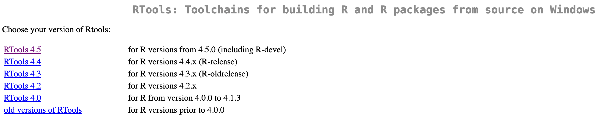
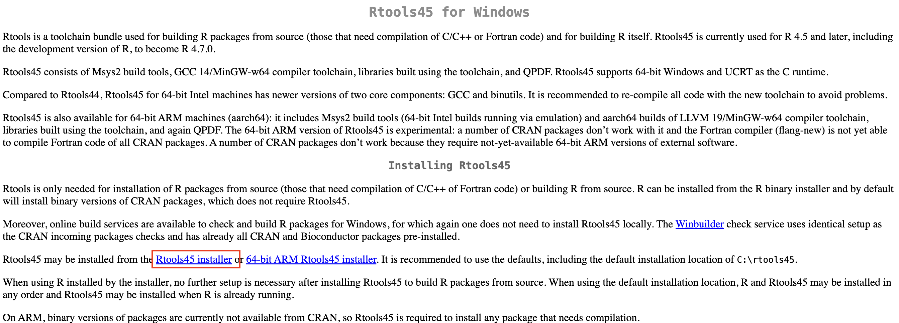
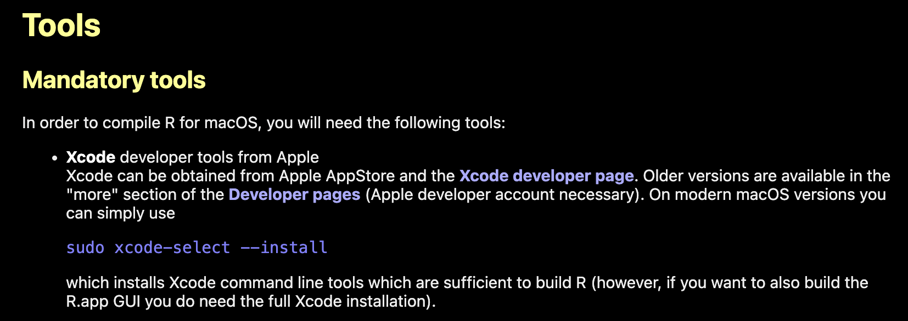

## Evitar conflictos para la instalación de paquetes en R

### Si usamos Windows debemos instalar Rtools

En **Windows** utilizamos **Rtools** para evitar problemas al instalar paquetes desde código fuente en RStudio. Selecciona la versión que se adapta a tu versión de R.

{fig-align="center"}

Yo seleccioné la versión Rtools 4.5 y me aparece la siguiente página web, después di clic en donde aparece el instalador, descargue el archivo y lo ejecute.



### Si usamos Mac/iOs debemos instalar Xcode

En **macOS**, no existe un equivalente directo a Rtools. En su lugar, se emplean las [**Xcode Command Line Tools**](https://mac.r-project.org/tools/) (que incluyen `clang` y `make`) junto con **GNU Fortran** para compilar paquetes que requieren código en C/C++ o Fortran.



Esto significa que, si trabajan en Mac, deben asegurarse de tener instaladas estas herramientas para evitar errores al instalar ciertos paquetes de R. Abre una terminal de Bash y coloca este código:

```{bash, eval=F}
sudo xcode-select --install
```
